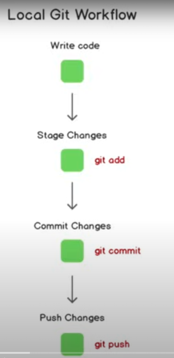

# Git Basics

## Git Workflow

### Create
Create a new file or change an existing file.
      
      git init will initialize new git project. 

### Stage Files
Tracks a file to be saved in Git.

    git add . will track all untracked files
    git add <filename or folder> will track specific file and folders 

### Commit
Saves the changes locally in git. Write in present tense, be brief.

    git commit -m "What and why you're committing" -m "some description"

### Push
Committed changes are pushed to the remote directory.  
origin = location of our git repository  
main - branch we want to commit to.

    git push origin main

## Terminal Commands

### Change directory  

    cd <directory-name>

### List 
List all files in directory

    ls 

### Initialize a new Git project
      git init

### Status
Show what files are modified and tracked

    git status

* Untracked files = git sees the file but has not started tracking changes yet.
* Changes to be committed = files have been added to the staging area.

### Add Origin
Add a reference to the remote repository on github

    git remote add origin <ssh-code>

### List Repositories
Shows any remote repositories you've connected to this repo

    git remote -v

### List Commits

      git log

* 40 character code (SHA) identifies the commit, written in orange.
* Author, date, time and commit message are displayed.

### Set Upstream
Say where you want to push to by default

    git push -u <origin master or other location>

### Check the differences between the working directory and staging area

      git diff <filename>

* changes are marked with a *+ and indicated in green.

### Unstage Files
Unstage files set to be committed.

    git restore --staged <file>...

### Check how many branches
Star beside = branch you're currently on
   
    git branch

### Switch between branches

    git checkout

### Make new branch

    git checkout -b <feature-name>

### Check Git Version

    git --version

# Github Clone

## Cloning a website from a Github Repository

1. Get the Repository Code
    * Navigate to the repository's main page on GitHub and copy the SSH code.
2. Clone the Repository to your Local Machine
    * In your terminal, use the 'git clone' command + the repository's URL.

## Creating a new branch and switching to it.

Use the following command:

    git checkout -b new-branch-name

This will let you work on the website files without affecting the main branch.

## Pushing the new branch to the remote repository
    git push origin new-branch-name

## Merging changes from a feature branch to the main branch

1. Create a pull request so others working on the project can review.
   * In Github repository, select Pull Requests in menu and click New pull request button.
   * Select the feature branch. All changes should be displayed.
   * Click Create pull request button. Leave a description saying how to test. "To Test: description how to test"
   * Add Reviewers, Edit Labels and Project if needed.
   * Click Create pull request button.

# Using the Nano Editor

### Open an existing file
      nano <filename.extension>

### Create a new file
      nano new_<filename.extension>
